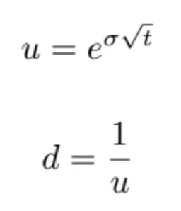
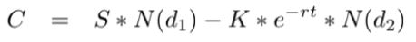
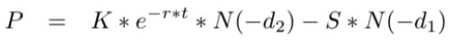

### Part I
First, we import all needed libraries and clean the environment
```{r message=FALSE, warning=FALSE, error=FALSE}
library(quantmod)
library(dplyr)
library(quadprog)
library(PerformanceAnalytics)
library(IntroCompFinR)
rm(list=ls())
```
## Option Validation

We start by downloading prices for MSFT 
```{r message=FALSE, warning=FALSE, error=FALSE}
tickers.list <- c("MSFT")
for (t in tickers.list){
  try(getSymbols(t,
                 from = "2017-11-07",
                 periodicity = "weekly",
                 src = "yahoo") )
}
objList <- lapply(tickers.list, get)
prices.zoo <- do.call(merge, objList)
returns.df <-as.data.frame(diff(log(Ad(prices.zoo))))
tickers.list <- as.list(tickers.list)
colnames(returns.df)<-tickers.list
```

First 6 values of the continiuosly compounded returns (CCR)
```{r message=FALSE, warning=FALSE, error=FALSE, echo=FALSE}
head(returns.df)
```

With the CCR we calculate the variance-covariance matrix, and the expected returns
```{r message=FALSE, warning=FALSE, error=FALSE}
COV <- var(returns.df, na.rm = TRUE)
ER <- exp(colMeans(returns.df, na.rm=TRUE)) - 1
```

With the variance-covariance matrix and the expected returns we can calculate the global minimum variance portfolio
```{r message=FALSE, warning=FALSE, error=FALSE}
gmvport <- globalMin.portfolio(ER, COV)
```

With the global minimum variance portfolio we can calculate the volatility
```{r message=FALSE, warning=FALSE, error=FALSE}
volatility <- as.numeric(gmvport[3])
volatility_annual <- volatility * sqrt(52)
```



```{r}
u <- exp(volatility)
d <- 1/u
```

Then, we need to calculate the annual risk-free rate
```{r}
getSymbols("TB3MS",
           src = "FRED")
Rf <- as.numeric(tail(TB3MS, 1))/52/100
RfAnnual <- Rf * 52

# S0 is today's value of the stock 
S0 <- as.numeric(tail(Ad(prices.zoo), 1))
# Time to expiration date in years
t <- 1
```

### Option pricing with a multiperiod binomial model
We created a function to replicate the multiperiod binomial model, using all the data that we previously calculated and downloaded
```{r}
# input: 
# call or put (option), initial stock price (S), growth factor (u), decline factor (d), 
# risk-free rate (Rf), number of simulations (n)
multiperiod_binomial <- function(option, S0, u, d, Rf, n) {
  if (option != "call" && option != "put"){
    return("error, option must be 'call' or 'put'")
  }
  cat("\n Parameters:","\n option:",option, ", S0:", S0, ", u:", u, 
      ", d:", d, ", Rf:", Rf, ", n:", n, "\n")
  # r: growth factor for risk-free investment.
  r = (1 + Rf)
  cat("\n r:",r)
  # q: f(u, d, r), prob of stock price going up
  q = (r - d) / (u - d)
  cat("\n q:", q)
  # K: strike price (any value K > S)
  K = S0 * 1.05
  cat("\n K:", K)
  acum_call_put = 0
  for (i in (1:n)) {
    S = S0
    # t: number of periods (weeks)
    t = 52
    for (j in (1:t)) {
      # state: random boolan variable to decide whether the price is going up or down.
      state = rbinom(1, 1, q)
      # calculate the stock price of the period
      # B0: risk-free bond, N: number of shares of the stock.
      if (state) {
        # Cu = (r * B0) + (N * u * S)
        S = S * u
      }
      else {
        # Cd = (r * B0) + (N * d * S)
        S = S * d
      } # end if state
    } # end for t
    
    if (option == "call"){
      # multiperiod binomial call
      call_put = max(0, (S-K))
    } else if (option == "put"){
      # multiperiod binomial put
      call_put = max(0, (K-S))
    }
    acum_call_put = acum_call_put + call_put
  } # end for n
  avrg_call_put = acum_call_put / n
  cat("\n average", option, ": ", avrg_call_put)
  # call_0: Present Value of avrg_call = avrg_call / (1 + Rf) ^ 52
  call_put_0 = avrg_call_put / (r ^ t)
  cat("\n present",option,"value:", call_put_0)
}
```


Multiperiod binomial function tests
```{r}
# test with incorrect option parameters
multiperiod_binomial("call error", S0, u, d, Rf, 1000)
# test call
multiperiod_binomial("call", S0, u, d, Rf, 1000)
# test put
multiperiod_binomial("put", S0, u, d, Rf, 1000)
```

### Option pricing with Black and Sholes model





We created a function to replicate the Black and Sholes model, using all the data that we previously calculated and downloaded
```{r}
d1 <- function(sd, S, k, r, t) {
  (log(S/k) + (r + ((sd^2) / 2)) * t) / (sd * sqrt(t))
}

d2 <- function(sd, S, k, r, t) {
  d1(sd, S, k, r, t) - (sd * sqrt(t))
}

black_sholes <- function(option, S, sd, RfAnnual, t){
  cat("\n Parameters:","\n option:",option, ", S0:", S, ", RfAnnual:", RfAnnual, ", t:", t, "\n")
  # K: strike price (any value K > S)
  K = S0 * 1.05
  cat("\n K:", K)
  if(option == "call"){
    result = (S * pnorm(d1(sd, S, K, RfAnnual, t))) - (K * exp(-RfAnnual * t) * pnorm(d2(sd, S, K, RfAnnual, t))) 
  }else if(option == "put"){
    result = (K * exp(-RfAnnual * t) * pnorm(-d2(sd, S, K, RfAnnual, t))) - (S * pnorm(-d1(sd, S, K, RfAnnual, t)))
  }else return("error, option must be 'call' or 'put'") 
  cat("\n",option,"value:", result)
}
```

Testing the Black and Sholes formula
```{r}
# test with incorrect option parameters
black_sholes("call error", S0, volatility_annual, RfAnnual, t)
# test call
black_sholes("call", S0, volatility_annual, RfAnnual, t)
# test put
black_sholes("put", S0, volatility_annual, RfAnnual, t)
```


## Part II

Instalation of quantstrat:
```{r message=FALSE, warning=FALSE, error=FALSE}
# install.packages("devtools")
# require(devtools)
# devtools::install_github("braverock/blotter") # dependency
# devtools::install_github("braverock/quantstrat")
```

We add the needed libraries:
```{r message=FALSE, warning=FALSE, error=FALSE}
library(quantmod)
library(quantstrat)
library(dplyr)
library(quadprog)
library(PerformanceAnalytics)
library(FinancialInstrument)
```

Cleaning the environment:
```{r message=FALSE, warning=FALSE, error=FALSE}
rm(list=ls())
```

Declare the DVO function
```{r message=FALSE, warning=FALSE, error=FALSE}
DVO <- function(HLC, navg = 2, percentlookback = 126) {
  # Compute the ratio between closing prices to the average of high and low
  ratio <- Cl(HLC)/((Hi(HLC) + Lo(HLC))/2)
  # Smooth out the ratio outputs using a moving average
  avgratio <- SMA(ratio, n = navg)
  # Convert ratio into a 0-100 value using runPercentRank()
  out <- runPercentRank(avgratio, n = percentlookback, exact.multiplier = 1) * 100
  colnames(out) <- "DVO"
  return(out)
}
```

Set the portafolio parameters
```{r message=FALSE, warning=FALSE, error=FALSE}
# set strategy, portfolio and account name
strategy.st <- portfolio.st <- account.st <- "teamstrat"
tradesize_initeq = 100000
symbol = "MSFT"
# SMA: Simple Moving Average
SMA_big = 200
SMA_small = 50
# RSI: Relative Strength Index
RSI_x = 3
# DVO: David Varadi Oscillator
DVO_x = 2
# An initialization date for the backtest
initdate <- "2005-01-01"
# The start of the data
from <- "2010-01-01"
# The end of the data
to <- "2018-11-20"
```

Retrieve symbol from yahoo
```{r message=FALSE, warning=FALSE, error=FALSE}
getSymbols(symbol, from=from, to=to, src="yahoo", adjust=TRUE)
```

We defined a portfolio strategy function to make it easier to adjust the strategy parameters and find better combinations for the indicators, signals and rules.  
```{r message=FALSE, warning=FALSE, error=FALSE, echo=T, results='hide'}
BuildPortfolioStrategy <- function(tradesize_initeq, symbol, initdate, SMA_big, SMA_small, RSI_x, DVO_x) {
  # Define the trade size and initial equity
  # param: tradesize_initeq
  tradesize <- tradesize_initeq
  initeq <- tradesize_initeq
  
  # Define the names of the strategy, portfolio and account
  strategy.st <- portfolio.st <- account.st <- "teamstrat"
  
  # Remove the existing portfolio and strategy if it exists
  rm.strat(portfolio.st)
  rm.strat(strategy.st)
  
  Sys.setenv(TZ = "UTC")
  currency("MXN")
  
  # Use stock() to initialize symbol and set currency to MXN
  # param: symbol
  stock(symbol, currency = "MXN")
  
  # Initialize the portfolio
  initPortf(portfolio.st, symbols = symbol, initDate = initdate, currency = "MXN")
  
  # Initialize the account
  initAcct(account.st, portfolios = portfolio.st, initDate = initdate, currency = "MXN", initEq = initeq)
  
  # Initialize the orders
  initOrders(portfolio.st, initDate = initdate)
  
  strategy(strategy.st, store=TRUE)
  
  # -------------------- Add Indicators --------------------
  
  # Add a X-day SMA indicator to strategy.st (big)
  # param: SMA_big
  add.indicator(strategy = strategy.st, 
                # Add the SMA function
                name = "SMA", 
                # Create a lookback period
                arguments = list(x = quote(Cl(mktdata)), n = SMA_big),
                # Label the indicator SMA_big
                label = "SMA_big")
  
  # Add a Y-day SMA indicator to strategy.st (small, X > Y)
  # param: SMA_small
  add.indicator(strategy = strategy.st, 
                # Add the SMA function
                name = "SMA", 
                # Create a lookback period
                arguments = list(x = quote(Cl(mktdata)), n = SMA_small), 
                # Label the indicator SMA_small
                label = "SMA_small")
  
  
  # Add an RSI X indicator to strategy.st
  # param: RSI_x
  add.indicator(strategy = strategy.st, 
                # Add the RSI function
                name = "RSI", 
                # Create a lookback period
                arguments = list(price = quote(Cl(mktdata)), n = RSI_x), 
                # Label the indicator RSI_x
                label = "RSI_x")
  
  # Add the DVO indicator to the strategy
  # param: DVO_x
  add.indicator(strategy = strategy.st, name = "DVO", 
                arguments = list(HLC = quote(HLC(mktdata)), navg = DVO_x, percentlookback = 126),
                label = "DVO_x_126")
  
  
  # -------------------- Add Signals --------------------
  
  # Add a sigComparison which specifies that SMA50 must be greater than SMA200, call it longfilter
  add.signal(strategy.st, name = "sigComparison", 
             # We are interested in the relationship between the SMA50 and the SMA200
             arguments = list(columns = c("SMA_small", "SMA_big"), 
                              # Particularly, we are interested when the SMA50 is greater than the SMA200
                              relationship = "gt"),
             # Label this signal longfilter
             label = "longfilter")
  
  # Add a sigCrossover which specifies that the SMA50 is less than the SMA200 and label it filterexit
  add.signal(strategy.st, name = "sigCrossover",
             # We're interested in the relationship between the SMA50 and the SMA200
             arguments = list(columns = c("SMA_small", "SMA_big"),
                              # The relationship is that the SMA50 crosses under the SMA200
                              relationship = "lt"),
             # Label it filterexit
             label = "filterexit")
  
  # Implement a sigThreshold which specifies that DVO_x_126 must be less than 20, label it longthreshold
  add.signal(strategy.st, name = "sigThreshold", 
             # Use the DVO_x_126 column
             arguments = list(column = "DVO_x_126", 
                              # The threshold is 20
                              threshold = 20, 
                              # We want the oscillator to be under this value
                              relationship = "lt",
                              # We're interested in every instance that the oscillator is less than 20
                              cross = FALSE),
             # Label it longthreshold
             label = "longthreshold")
  
  # Add a sigThreshold signal to the strategy that specifies that DVO_x_126 must cross above 80 and label it thresholdexit
  add.signal(strategy.st, name = "sigThreshold",
             # Reference the column of DVO_x_126
             arguments = list(column = "DVO_x_126", 
                              # Set a threshold of 80
                              threshold = 80, 
                              # The oscillator must be greater than 80
                              relationship = "gt", 
                              # We are interested only in the cross
                              cross = TRUE), 
             # Label it thresholdexit
             label = "thresholdexit")
  
  # Create the dataset: test
  test_init <- applyIndicators(strategy.st, mktdata = OHLC(get(symbol)))
  test <- applySignals(strategy = strategy.st, mktdata = test_init)
  
  # Add a sigFormula signal to the code specifying that both longfilter and longthreshold must be TRUE, label it longentry
  add.signal(strategy.st, name = "sigFormula",
             # Specify that longfilter and longthreshold must be TRUE
             arguments = list(formula = "longfilter & longthreshold", 
                              # Specify that cross must be TRUE
                              cross = TRUE),
             # Label it longentry
             label = "longentry")
  
  
  # -------------------- Add Rules --------------------
  
  # Fill in the rule's type as exit
  add.rule(strategy.st, name = "ruleSignal", 
           arguments = list(sigcol = "filterexit", sigval = TRUE, orderqty = "all", 
                            ordertype = "market", orderside = "long", 
                            replace = FALSE, prefer = "Open"), 
           type = "exit")
  
  # Create an entry rule of 1 share when all conditions line up to enter into a position
  add.rule(strategy.st, name = "ruleSignal", 
           # Use the longentry column as the sigcol
           arguments=list(sigcol = "longentry", 
                          # Set sigval to TRUE
                          sigval = TRUE, 
                          # Set orderqty to 1
                          orderqty = 1,
                          # Use a market type of order
                          ordertype = "market",
                          # Take the long orderside
                          orderside = "long",
                          # Do not replace other signals
                          replace = FALSE, 
                          # Buy at the next day's opening price
                          prefer = "Open"),
           # This is an enter type rule, not an exit
           type = "enter")
}
```

### Build portafolio strategy with the defined parameters
```{r message=FALSE, warning=FALSE, error=FALSE, echo=T, results='hide'}
BuildPortfolioStrategy(tradesize_initeq, symbol, initdate, SMA_big, SMA_small, RSI_x, DVO_x)
```

### Analyze Results
```{r message=FALSE, warning=FALSE, error=FALSE, echo=T, results='hide'}
# Use applyStrategy() to apply the strategy. Save this to out
out <- applyStrategy(strategy = strategy.st, portfolios = portfolio.st)

# Update the portfolio (portfolio.st)
updatePortf(portfolio.st)
daterange <- time(getPortfolio(portfolio.st)$summary)[-1]

# Update the account (account.st)
updateAcct(account.st, daterange)
updateEndEq(account.st)

# Get the tradeStats for the portfolio
tstats <- tradeStats(Portfolios = portfolio.st)

```
Print the profit factor
```{r message=FALSE, warning=FALSE, error=FALSE}
tstats$Profit.Factor
```

```{r message=FALSE, warning=FALSE, error=FALSE}
# Use chart.Posn to view the system's performance on the symbol
chart.Posn(Portfolio = portfolio.st, Symbol = symbol)

# Compute the SMA_small 
sma_s <- SMA(x = Cl(get(symbol)), n = SMA_small)

# Compute the SMA_big
sma_b <- SMA(x = Cl(get(symbol)), n = SMA_big)

# Compute the DVO_x_126 with an navg of DVO_x and a percentlookback of 126
dvo <- DVO(HLC = HLC(get(symbol)), navg = DVO_x, percentlookback = 126)

# Recreate the chart.Posn of the strategy from the previous exercise
chart.Posn(Portfolio = portfolio.st, Symbol = symbol)

# Overlay the sma_small on the plot as a blue line
add_TA(sma_s, on = 1, col = "blue")

# Overlay the SMA_big on the plot as a red line
add_TA(sma_b, on = 1, col = "red")

# Add the DVO_x_126 to the plot in a new window
add_TA(dvo)

# ---> Sharpe ratio

# Get instrument returns
instrets <- PortfReturns(portfolio.st)

# Compute Sharpe ratio from returns
SharpeRatio.annualized(instrets, geometric = FALSE)
```


### Part III

A Pythagorean triplet is a set of three natural numbers, a < b < c, for which a^2 + b^2 = c^2. Given an integer N, check if there exists a Pythagorean triplet for which a + b + c = N, return value: a * b * c if there exists such triplet, otherwise, return -1
```{r}
extra_points <- function(N){
  aux = 0
  for(a in (1:(N/3))){
    for(b in (a:(N/2))){
      c = N - a - b
      if((a*a + b*b) == (c*c)){
        return(a * b * c)
      }
    }
  }
  return(-1)
}
extra_points(1000)
```


